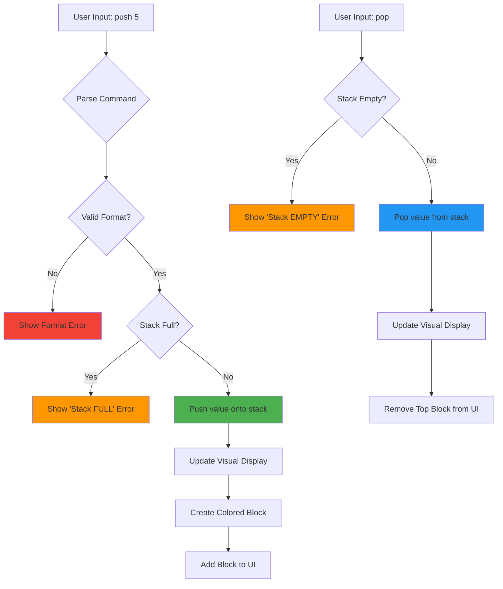
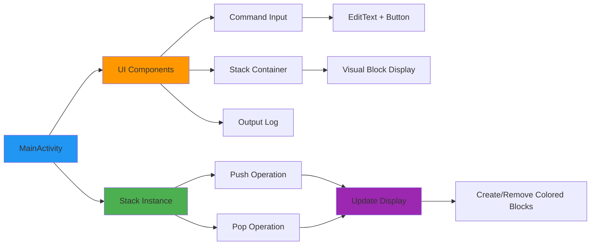
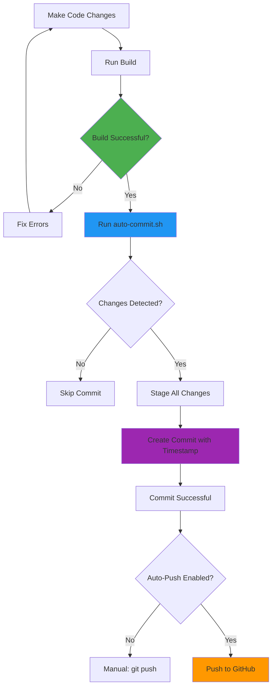

# StackApp - Visual Stack Data Structure

A beautiful Android application that implements and visualizes the Stack (LIFO - Last In First Out) data structure with colored blocks. Built with Kotlin and Android SDK.


## 📱 About The App

StackApp is an interactive educational app that demonstrates how a **Stack data structure** works. Instead of showing boring text like `Stack [5, 3, 7]`, it displays beautiful colored blocks that stack visually from bottom to top - just like a real stack!

### ✨ Features

- 🎨 **Visual Stack Display** - Each number (0-9) has its own unique color
- 📚 **LIFO Implementation** - Last In, First Out data structure
- 🎯 **Max Size: 3** - Stack can hold up to 3 elements
- 🔍 **Smart Error Detection** - Catches format errors like "push8" (missing space)
- 🎭 **Modern Material Design** - Clean card-based UI with elevation effects
- 📝 **Real-time Feedback** - See immediate visual changes with every command
- 🖥️ **Command-Based Interface** - Learn stack operations through commands

## 🎨 Color Scheme

Each digit has a distinct, carefully chosen color for easy visualization:

| Digit | Color          | Hex Code |
|-------|----------------|----------|
| 0     | 🔴 Red         | #E57373  |
| 1     | 🩷 Pink        | #F06292  |
| 2     | 🟣 Purple      | #BA68C8  |
| 3     | 💜 Deep Purple | #9575CD  |
| 4     | 🔵 Indigo      | #7986CB  |
| 5     | 💙 Blue        | #64B5F6  |
| 6     | 🌊 Light Blue  | #4FC3F7  |
| 7     | 🌿 Teal        | #4DB6AC  |
| 8     | 💚 Green       | #81C784  |
| 9     | 🧡 Orange      | #FFB74D  |

## 🎮 How to Use

### Available Commands

The app supports three simple commands:

1. **`push X`** - Push a digit (0-9) onto the stack
   - Example: `push 5`, `push 3`, `push 7`

2. **`pop`** - Remove the top element from the stack
   - Example: `pop`

3. **`quit`** - Exit the application
   - Example: `quit`

### Example Session

```bash
> push 5
✅ 5 is pushed. Stack [5]
# A blue block appears

> push 3
✅ 3 is pushed. Stack [5 3]
# A deep purple block appears on top

> push 7
✅ 7 is pushed. Stack [5 3 7]
# A teal block appears on top

> push 9
❌ Stack is FULL. Stack [5 3 7]
# Error: stack is full!

> pop
✅ 7 is popped. Stack [5 3]
# Top block (teal) disappears

> pop
✅ 3 is popped. Stack [5]
# Next block (purple) disappears

> pop
✅ 5 is popped. Stack [ ]
# Last block (blue) disappears - stack is empty
```

### Common Errors

| Input                  | Error                               | Correct Format         |
|------------------------|-------------------------------------|------------------------|
| `push8`                | ❌ Format Error: Missing space       | `push 8`               |
| `push 10`              | ❌ Value must be single digit (0-9)  | `push 1` then `push 0` |
| `push`                 | ❌ Invalid push format               | `push 5`               |
| `pop` (on empty stack) | ❌ Stack is EMPTY                    | First use `push X`     |

## 🏗️ How It Works

### Stack Data Structure Flow



### Stack Implementation

The stack is implemented **from scratch** without using built-in library functions:

```kotlin
class Stack {
    private val data = IntArray(MAX_SIZE)  // Array to store elements
    private var topIndex = -1               // -1 means empty stack

    companion object {
        const val MAX_SIZE = 3
    }

    fun push(value: Int): Boolean {
        if (isFull()) return false
        topIndex++
        data[topIndex] = value
        return true
    }

    fun pop(): Int? {
        if (isEmpty()) return null
        val value = data[topIndex]
        topIndex--
        return value
    }

    fun isEmpty() = topIndex == -1
    fun isFull() = topIndex == MAX_SIZE - 1
}
```

### UI Architecture



## 🚀 Installation & Setup

### Prerequisites

- Android Studio (Latest version recommended)
- JDK 17 or higher
- Android SDK (API 24+)
- Git

### Clone & Run

```bash
# Clone the repository
git clone https://github.com/LemonmadeDesigns/StackApp.git

# Open in Android Studio
cd StackApp
# File -> Open -> Select StackApp folder

# Build and run
./gradlew assembleDebug

# Or click the green Run button in Android Studio
```

### First Time Setup

1. Open the project in Android Studio
2. Wait for Gradle sync to complete
3. Connect an Android device or start an emulator
4. Click the **Run** button (green triangle) or press `Shift+F10`
5. The app will install and launch automatically

## 🔄 Auto-Commit System

This project includes an **automated Git commit system** that commits your changes after every successful build!

### How Auto-Commit Works



### Auto-Commit Workflow

The system works in three modes:

#### **Mode 1: Manual Auto-Commit** (Recommended)

After making changes and building successfully:

```bash
# Build the app
./gradlew assembleDebug

# If build succeeds, auto-commit
./auto-commit.sh

# Push to GitHub manually when ready
git push
```

#### **Mode 2: Gradle Task** (Semi-Automatic)

Run both build and commit in one command:

```bash
./gradlew assembleDebug autoCommit

# Then push when ready
git push
```

#### **Mode 3: Fully Automatic** (Advanced)

Enable auto-commit after EVERY successful build:

1. Open `app/build.gradle.kts`
2. Find line 96
3. Uncomment this line:
   ```kotlin
   tasks.named("autoCommit").get().exec()
   ```
4. Now every `./gradlew assembleDebug` automatically commits!

### What Gets Committed

The auto-commit script:
- ✅ Checks for any file changes
- ✅ Stages all changes (`git add -A`)
- ✅ Creates a commit with timestamp
- ✅ Adds a professional commit message
- ✅ Shows what was committed

**Example commit message:**
```
Auto-commit: Successful build at 2025-10-19 12:30:45
```

### Auto-Commit Script Location

The script is located at: `./auto-commit.sh`

You can run it anytime to commit changes:
```bash
./auto-commit.sh
```

### Push to GitHub

After commits are created locally, push to GitHub:

```bash
# Push all commits to GitHub
git push

# First time only (already done in setup)
git push -u origin main
```

### Setting Up Auto-Push (Optional)

To automatically push after commits, modify `auto-commit.sh`:

```bash
# At the end of auto-commit.sh, add:
git push
```

**⚠️ Warning:** Auto-push means every commit goes to GitHub immediately. Use with caution!

## 🛠️ Tech Stack

- **Language:** Kotlin
- **UI Framework:** Android Views (XML layouts)
- **Min SDK:** API 24 (Android 7.0 Nougat)
- **Target SDK:** API 35
- **Build System:** Gradle with Kotlin DSL
- **Version Control:** Git + GitHub
- **IDE:** Android Studio

## 📂 Project Structure

```
StackApp/
├── app/
│   ├── src/
│   │   ├── main/
│   │   │   ├── java/com/example/stackapp/
│   │   │   │   ├── MainActivity.kt        # Main activity with UI logic
│   │   │   │   └── Stack.kt               # Stack data structure implementation
│   │   │   ├── res/
│   │   │   │   ├── layout/
│   │   │   │   │   └── activity_main.xml  # UI layout with colored blocks
│   │   │   │   └── values/
│   │   │   │       ├── strings.xml        # String resources
│   │   │   │       ├── colors.xml         # Color definitions
│   │   │   │       └── themes.xml         # App theme
│   │   │   └── AndroidManifest.xml        # App configuration
│   │   └── test/                          # Unit tests
│   └── build.gradle.kts                   # App build configuration
├── auto-commit.sh                         # Auto-commit script
├── build.gradle.kts                       # Project build configuration
├── settings.gradle.kts                    # Gradle settings
└── README.md                              # This file
```

## 🧪 Testing

Run unit tests:
```bash
./gradlew test
```

Run instrumented tests (requires emulator/device):
```bash
./gradlew connectedAndroidTest
```

## 📸 Screenshots

> Screenshots coming soon! Run the app to see the beautiful colored stack visualization.

## 🤝 Contributing

Contributions are welcome! Feel free to:

1. Fork the repository
2. Create a feature branch (`git checkout -b feature/AmazingFeature`)
3. Commit your changes (use `./auto-commit.sh` 😉)
4. Push to the branch (`git push origin feature/AmazingFeature`)
5. Open a Pull Request

## 📝 License

This project is licensed under the MIT License.

## 👨‍💻 Author

**LemonmadeDesigns**
- GitHub: [@LemonmadeDesigns](https://github.com/LemonmadeDesigns)
- Repository: [StackApp](https://github.com/LemonmadeDesigns/StackApp)

## 🙏 Acknowledgments

- Inspired by data structure visualization needs in computer science education
- Color palette inspired by Material Design guidelines

---

**Made with ❤️ and Kotlin**

*Stack data structures never looked so good!*
