# Stack Application - Complete Setup Guide

This guide will walk you through creating a Stack Application for Android from scratch, including environment setup, project creation, coding, and running the app.

> 📦 **Zero External Dependencies** • 🏗️ **Built from Scratch** • 🎯 **Pure Android SDK**

---

## 📋 Overview

This is a minimal Android application that demonstrates the **Stack (LIFO)** data structure with a clean Material Design interface. The app is built entirely from scratch without any external third-party libraries - using only the official Android SDK framework.

### ✨ Key Features

- 🚫 **No External Libraries** - Only official Android framework components
- 📱 **Material Design UI** - Clean, modern interface following Material Design principles
- 🔧 **Custom Stack Implementation** - Written from scratch without using built-in collections
- 🎨 **XML Layouts** - Traditional Android Views (no Jetpack Compose)
- ✅ **Complete Validation** - Input validation and error handling
- 📊 **Real-time Updates** - Live stack visualization with status indicators

---

## 🛠️ Tech Stack & Dependencies

### Core Technologies
- **Language**: Kotlin
- **UI Framework**: Android Views (XML layouts)
- **Build System**: Gradle with Kotlin DSL
- **Min SDK**: API 24 (Android 7.0 Nougat)
- **Target SDK**: API 35

### Dependencies

This app uses **ONLY** the official Android framework libraries (not third-party):

```kotlin
dependencies {
    // Official Android framework libraries
    implementation("androidx.core:core-ktx")        // Android core utilities
    implementation("androidx.appcompat:appcompat")  // AppCompatActivity & Material components

    // Testing libraries (optional)
    testImplementation("junit:junit")
    androidTestImplementation("androidx.test.ext:junit")
    androidTestImplementation("androidx.test.espresso:espresso-core")
}
```

> **Note**: `androidx.core` and `androidx.appcompat` are part of the official Android SDK maintained by Google. They provide backward compatibility and standard Android components. These are NOT external third-party libraries.

### What We're NOT Using
- ❌ No Jetpack Compose
- ❌ No external UI libraries
- ❌ No third-party dependencies
- ❌ No Material Components library (using built-in XML attributes only)
- ❌ No data structure libraries (Stack built from scratch)

---

## Table of Contents
1. [Environment Setup](#1-environment-setup)
2. [Create New Android Project](#2-create-new-android-project)
3. [Project Structure Overview](#3-project-structure-overview)
4. [Implement the Stack Data Structure](#4-implement-the-stack-data-structure)
5. [Design the User Interface](#5-design-the-user-interface)
6. [Implement MainActivity Logic](#6-implement-mainactivity-logic)
7. [Setup Android Emulator](#7-setup-android-emulator)
8. [Run the Application](#8-run-the-application)
9. [Testing the App](#9-testing-the-app)
10. [Troubleshooting](#10-troubleshooting)

---

## 1. Environment Setup

### Step 1.1: Download Android Studio

1. Go to the official Android Studio website: https://developer.android.com/studio
2. Click the **Download Android Studio** button
3. Accept the terms and conditions
4. Download the appropriate version for your operating system:
   - **Windows**: `.exe` installer
   - **macOS**: `.dmg` file
   - **Linux**: `.tar.gz` archive

### Step 1.2: Install Android Studio

#### For Windows:
1. Run the `.exe` installer
2. Follow the setup wizard
3. Choose "Standard" installation type
4. Accept the license agreements
5. Click "Finish" to complete installation

#### For macOS:
1. Open the downloaded `.dmg` file
2. Drag Android Studio to the Applications folder
3. Open Android Studio from Applications
4. Follow the setup wizard
5. Choose "Standard" installation type

#### For Linux:
1. Extract the `.tar.gz` file to a suitable location
2. Navigate to `android-studio/bin/` directory
3. Run `./studio.sh` to start Android Studio
4. Follow the setup wizard

### Step 1.3: Complete Initial Setup

1. When Android Studio first launches, you'll see the "Welcome" screen
2. Click through the setup wizard:
   - Choose "Standard" installation
   - Select your preferred UI theme (Light or Dark)
3. Android Studio will download necessary SDK components:
   - Android SDK
   - Android SDK Platform
   - Android SDK Build-Tools
   - Android Emulator
   - Android SDK Platform-Tools
4. Wait for all downloads to complete (this may take 10-20 minutes)
5. Click "Finish" when done

### Step 1.4: Verify Java JDK

Android Studio comes bundled with a JDK (Java Development Kit). To verify:

1. Open Android Studio
2. Go to **File > Project Structure > SDK Location**
3. Check that "JDK location" is set (usually bundled with Android Studio)

---

## 2. Create New Android Project

### Step 2.1: Start a New Project

1. Open Android Studio
2. Click **New Project** on the welcome screen (or **File > New > New Project**)
3. Select **Empty Views Activity** template
4. Click **Next**

### Step 2.2: Configure Your Project

Fill in the project configuration:

- **Name**: `StackApp`
- **Package name**: `com.example.stackapp`
- **Save location**: Choose a directory on your computer
- **Language**: **Kotlin**
- **Minimum SDK**: **API 24: Android 7.0 (Nougat)** or higher
- **Build configuration language**: **Kotlin DSL (build.gradle.kts)**

Click **Finish** and wait for Gradle to build the project (this takes a few minutes).

### Step 2.3: Wait for Gradle Sync

Android Studio will:
1. Create the project structure
2. Download necessary dependencies
3. Index files
4. Build the project

You'll see a progress bar at the bottom. Wait until it says "Build Successful" or "Gradle sync finished".

### Step 2.4: Configure Minimal Dependencies (Important!)

By default, Android Studio may include unnecessary dependencies. Let's clean them up:

1. Open `app/build.gradle.kts`
2. Find the `android { }` block and **remove** the Compose-related sections:

```kotlin
// ❌ REMOVE these lines if they exist:
buildFeatures {
    compose = true
}

composeOptions {
    kotlinCompilerExtensionVersion = "1.5.14"
}
```

3. In the `dependencies { }` block, **replace** all dependencies with only these minimal ones:

```kotlin
dependencies {
    // Only these two official Android libraries
    implementation(libs.androidx.core.ktx)
    implementation(libs.androidx.appcompat)

    // Testing libraries (optional - can be removed if not testing)
    testImplementation(libs.junit)
    androidTestImplementation(libs.androidx.junit)
    androidTestImplementation(libs.androidx.espresso.core)
}
```

4. **Delete** the `ui/theme` folder if it exists:
   - Right-click on `app/src/main/java/com/example/stackapp/ui/`
   - Select **Delete**
   - This folder contains unused Compose theme files

5. Click **Sync Now** in the notification bar that appears

6. Build the project: **Build > Rebuild Project**

> **Why?** This ensures we're only using the minimal Android framework libraries without any external dependencies or unused code.

---

## 3. Project Structure Overview

Once your project is created, you'll see this structure:

```
StackApp/
├── app/
│   ├── src/
│   │   ├── main/
│   │   │   ├── java/com/example/stackapp/
│   │   │   │   └── MainActivity.kt        # Main app logic
│   │   │   ├── res/
│   │   │   │   ├── layout/
│   │   │   │   │   └── activity_main.xml  # UI layout
│   │   │   │   ├── values/
│   │   │   │   │   ├── strings.xml        # String resources
│   │   │   │   │   ├── colors.xml         # Color resources
│   │   │   │   │   └── themes.xml         # App themes
│   │   │   └── AndroidManifest.xml        # App configuration
│   │   └── test/                          # Test files
│   └── build.gradle.kts                   # App-level Gradle config
├── gradle/                                # Gradle wrapper files
└── build.gradle.kts                       # Project-level Gradle config
```

---

## 4. Implement the Stack Data Structure

### Step 4.1: Create Stack.kt File

1. In Android Studio, right-click on `app/src/main/java/com/example/stackapp/`
2. Select **New > Kotlin File/Class**
3. Name it: `Stack`
4. Select **Class** as the type
5. Click **OK**

### Step 4.2: Write the Stack Class

Open `Stack.kt` and replace its contents with:

```kotlin
package com.example.stackapp

/**
 * Stack data structure implementation (LIFO - Last In First Out)
 * Coded from scratch without using library functions
 * Maximum size: 3 elements
 * Elements: integers 0-9
 */
class Stack {
    // Using an array to store stack elements
    private val data = IntArray(MAX_SIZE)

    // Top of stack index (-1 means empty stack)
    private var topIndex = -1

    companion object {
        const val MAX_SIZE = 3
    }

    /**
     * Push an element onto the stack
     * @param value the integer value to push (must be 0-9)
     * @return true if successful, false if stack is full
     */
    fun push(value: Int): Boolean {
        if (isFull()) {
            return false
        }
        topIndex++
        data[topIndex] = value
        return true
    }

    /**
     * Pop an element from the stack
     * @return the popped value, or null if stack is empty
     */
    fun pop(): Int? {
        if (isEmpty()) {
            return null
        }
        val value = data[topIndex]
        topIndex--
        return value
    }

    /**
     * Check if stack is empty
     * @return true if empty, false otherwise
     */
    fun isEmpty(): Boolean {
        return topIndex == -1
    }

    /**
     * Check if stack is full
     * @return true if full, false otherwise
     */
    fun isFull(): Boolean {
        return topIndex == MAX_SIZE - 1
    }

    /**
     * Get the current size of the stack
     * @return number of elements in the stack
     */
    fun size(): Int {
        return topIndex + 1
    }

    /**
     * Get the contents of the stack as a string representation
     * Format: [bottom ... top] with rightmost being top of stack
     * @return string representation of stack contents
     */
    fun getContents(): String {
        if (isEmpty()) {
            return "[ ]"
        }

        val contents = StringBuilder("[")
        for (i in 0..topIndex) {
            contents.append(data[i])
            if (i < topIndex) {
                contents.append(" ")
            }
        }
        contents.append("]")
        return contents.toString()
    }
}
```

**Save the file** (Ctrl+S or Cmd+S).

---

## 5. Design the User Interface

### Step 5.1: Open Layout File

1. Navigate to `app/src/main/res/layout/`
2. Open `activity_main.xml`
3. Switch to **Code** view (not Design view) using the tabs at the top-right

### Step 5.2: Replace Layout XML

Replace the entire contents of `activity_main.xml` with:

```xml
<?xml version="1.0" encoding="utf-8"?>
<ScrollView xmlns:android="http://schemas.android.com/apk/res/android"
    android:layout_width="match_parent"
    android:layout_height="match_parent"
    android:background="#F5F5F5">

    <LinearLayout
        android:padding="16dp"
        android:layout_width="match_parent"
        android:layout_height="wrap_content"
        android:orientation="vertical">

        <!-- Title Section -->
        <TextView
            android:id="@+id/tvTitle"
            android:layout_width="wrap_content"
            android:layout_height="wrap_content"
            android:text="Stack Application"
            android:textStyle="bold"
            android:textSize="24sp"
            android:textColor="#212121"
            android:paddingBottom="8dp" />

        <TextView
            android:id="@+id/tvHint"
            android:layout_width="wrap_content"
            android:layout_height="wrap_content"
            android:text="Enter a digit (0-9) and use the buttons below"
            android:textSize="14sp"
            android:textColor="#666666"
            android:paddingBottom="16dp" />

        <!-- Input Section -->
        <LinearLayout
            android:layout_width="match_parent"
            android:layout_height="wrap_content"
            android:orientation="vertical"
            android:background="#FFFFFF"
            android:padding="16dp"
            android:elevation="2dp"
            android:layout_marginBottom="16dp">

            <TextView
                android:layout_width="wrap_content"
                android:layout_height="wrap_content"
                android:text="Input"
                android:textStyle="bold"
                android:textSize="16sp"
                android:textColor="#212121"
                android:paddingBottom="8dp" />

            <EditText
                android:id="@+id/etInput"
                android:layout_width="match_parent"
                android:layout_height="wrap_content"
                android:hint="Enter value (0-9)"
                android:inputType="text"
                android:maxLength="1"
                android:importantForAutofill="no"
                android:minHeight="48dp"
                android:paddingVertical="12dp"
                android:paddingHorizontal="12dp"
                android:textSize="16sp"
                android:background="#F5F5F5" />

            <!-- Button Row -->
            <LinearLayout
                android:layout_width="match_parent"
                android:layout_height="wrap_content"
                android:orientation="horizontal"
                android:layout_marginTop="12dp"
                android:weightSum="3">

                <Button
                    android:id="@+id/btnPush"
                    android:layout_width="0dp"
                    android:layout_height="wrap_content"
                    android:layout_weight="1"
                    android:text="Push"
                    android:textSize="14sp"
                    android:layout_marginEnd="8dp" />

                <Button
                    android:id="@+id/btnPop"
                    android:layout_width="0dp"
                    android:layout_height="wrap_content"
                    android:layout_weight="1"
                    android:text="Pop"
                    android:textSize="14sp"
                    android:layout_marginStart="4dp"
                    android:layout_marginEnd="4dp" />

                <Button
                    android:id="@+id/btnQuit"
                    android:layout_width="0dp"
                    android:layout_height="wrap_content"
                    android:layout_weight="1"
                    android:text="Quit"
                    android:textSize="14sp"
                    android:layout_marginStart="8dp" />
            </LinearLayout>
        </LinearLayout>

        <!-- Stack Display Section -->
        <LinearLayout
            android:layout_width="match_parent"
            android:layout_height="wrap_content"
            android:orientation="vertical"
            android:background="#FFFFFF"
            android:padding="16dp"
            android:elevation="2dp"
            android:layout_marginBottom="16dp">

            <TextView
                android:layout_width="wrap_content"
                android:layout_height="wrap_content"
                android:text="Stack Display"
                android:textStyle="bold"
                android:textSize="16sp"
                android:textColor="#212121"
                android:paddingBottom="8dp" />

            <TextView
                android:id="@+id/tvStackDisplay"
                android:layout_width="match_parent"
                android:layout_height="wrap_content"
                android:minHeight="80dp"
                android:text="Stack: [ ]\nStatus: Empty"
                android:textSize="14sp"
                android:textColor="#424242"
                android:background="#F5F5F5"
                android:padding="12dp"
                android:fontFamily="monospace"
                android:lineSpacingExtra="4dp"
                android:focusable="false"
                android:clickable="false"
                android:cursorVisible="false" />
        </LinearLayout>

        <!-- Error/Output Section -->
        <LinearLayout
            android:layout_width="match_parent"
            android:layout_height="wrap_content"
            android:orientation="vertical"
            android:background="#FFFFFF"
            android:padding="16dp"
            android:elevation="2dp"
            android:layout_marginBottom="16dp">

            <TextView
                android:layout_width="wrap_content"
                android:layout_height="wrap_content"
                android:text="Errors / Messages"
                android:textStyle="bold"
                android:textSize="16sp"
                android:textColor="#212121"
                android:paddingBottom="8dp" />

            <TextView
                android:id="@+id/tvErrors"
                android:layout_width="match_parent"
                android:layout_height="wrap_content"
                android:minHeight="60dp"
                android:text="Ready"
                android:textSize="14sp"
                android:textColor="#424242"
                android:background="#FFF9C4"
                android:padding="12dp"
                android:lineSpacingExtra="4dp"
                android:focusable="false"
                android:clickable="false"
                android:cursorVisible="false" />
        </LinearLayout>

    </LinearLayout>
</ScrollView>
```

**Save the file** (Ctrl+S or Cmd+S).

---

## 6. Implement MainActivity Logic

### Step 6.1: Open MainActivity.kt

Navigate to `app/src/main/java/com/example/stackapp/MainActivity.kt`

### Step 6.2: Replace MainActivity Code

Replace the entire contents with:

```kotlin
package com.example.stackapp

import android.os.Bundle
import android.widget.Button
import android.widget.EditText
import android.widget.TextView
import androidx.appcompat.app.AppCompatActivity

class MainActivity : AppCompatActivity() {
    // Stack instance (coded from scratch)
    private val stack = Stack()

    // UI components
    private lateinit var etInput: EditText
    private lateinit var btnPush: Button
    private lateinit var btnPop: Button
    private lateinit var btnQuit: Button
    private lateinit var tvStackDisplay: TextView
    private lateinit var tvErrors: TextView

    override fun onCreate(savedInstanceState: Bundle?) {
        super.onCreate(savedInstanceState)
        setContentView(R.layout.activity_main)

        // Initialize UI components
        etInput = findViewById(R.id.etInput)
        btnPush = findViewById(R.id.btnPush)
        btnPop = findViewById(R.id.btnPop)
        btnQuit = findViewById(R.id.btnQuit)
        tvStackDisplay = findViewById(R.id.tvStackDisplay)
        tvErrors = findViewById(R.id.tvErrors)

        // Set up button click listeners
        btnPush.setOnClickListener {
            handlePush()
        }

        btnPop.setOnClickListener {
            handlePop()
        }

        btnQuit.setOnClickListener {
            handleQuit()
        }

        // Initialize display
        updateStackDisplay()
        showMessage("Ready")
    }

    /**
     * Handle push operation
     * Reads value from input field and pushes to stack
     */
    private fun handlePush() {
        val inputStr = etInput.text.toString().trim()

        // Check if input is empty
        if (inputStr.isEmpty()) {
            showError("Error: Please enter a value (0-9)")
            return
        }

        // Validate that input is a single digit 0-9
        if (inputStr.length != 1 || !inputStr[0].isDigit()) {
            showError("Error: Value must be a single digit (0-9)")
            return
        }

        val value = inputStr.toInt()

        // Validate range
        if (value < 0 || value > 9) {
            showError("Error: Value must be between 0 and 9")
            return
        }

        // Attempt to push
        if (stack.push(value)) {
            showMessage("Success: $value pushed to stack")
            etInput.text.clear() // Clear input after successful push
        } else {
            showError("Error: Stack is FULL. Cannot push $value")
        }

        updateStackDisplay()
    }

    /**
     * Handle pop operation
     * Removes top element from stack
     */
    private fun handlePop() {
        val poppedValue = stack.pop()

        if (poppedValue != null) {
            showMessage("Success: $poppedValue popped from stack")
        } else {
            showError("Error: Stack is EMPTY. Cannot pop")
        }

        updateStackDisplay()
    }

    /**
     * Handle quit operation
     * Closes the application
     */
    private fun handleQuit() {
        showMessage("Exiting application...")
        finish() // Close the application
    }

    /**
     * Update the stack display TextView
     * Shows current stack contents and status (Empty/Full)
     */
    private fun updateStackDisplay() {
        val contents = stack.getContents()
        val status = when {
            stack.isEmpty() -> "Empty"
            stack.isFull() -> "Full"
            else -> "Normal (${stack.size()}/${Stack.MAX_SIZE})"
        }

        tvStackDisplay.text = "Stack: $contents\nStatus: $status"
    }

    /**
     * Show a regular message in the errors TextView
     */
    private fun showMessage(message: String) {
        tvErrors.text = message
    }

    /**
     * Show an error message in the errors TextView
     */
    private fun showError(errorMessage: String) {
        tvErrors.text = errorMessage
    }
}
```

**Save the file** (Ctrl+S or Cmd+S).

### Step 6.3: Sync Project

1. Click **File > Sync Project with Gradle Files**
2. Wait for sync to complete

---

## 7. Setup Android Emulator

### Step 7.1: Open Device Manager

1. In Android Studio, click the **Device Manager** icon (phone icon) in the top-right toolbar
2. Or go to **Tools > Device Manager**

### Step 7.2: Create Virtual Device

1. Click **Create Device** button
2. Select a device definition:
   - Choose **Phone** category
   - Select **Pixel 6** (or any recent Pixel device)
   - Click **Next**

### Step 7.3: Select System Image

1. Select a system image (Android version):
   - Choose **UpsideDownCake** (API 34) or latest available
   - If not downloaded, click the **Download** link next to the system image
   - Wait for download to complete
2. Click **Next**

### Step 7.4: Verify Configuration

1. Review the AVD (Android Virtual Device) configuration:
   - **AVD Name**: You can keep the default or rename it
   - **Startup orientation**: Portrait
   - **Graphics**: Automatic
2. Click **Finish**

### Step 7.5: Start Emulator

1. In Device Manager, find your newly created virtual device
2. Click the **Play** (▶) button to launch the emulator
3. Wait for the emulator to boot up (this may take 1-2 minutes the first time)

---

## 8. Run the Application

### Step 8.1: Select Run Configuration

1. At the top toolbar, ensure your run configuration is set to **app**
2. Select your emulator from the device dropdown menu

### Step 8.2: Run the App

1. Click the **Run** button (green play icon ▶) in the top toolbar
2. Or press **Shift + F10** (Windows/Linux) or **Control + R** (macOS)

### Step 8.3: Build and Deploy

Android Studio will:
1. Build the APK (Android Package)
2. Install it on the emulator
3. Launch the application

The first build may take 1-2 minutes. Subsequent builds are faster.

### Step 8.4: View Your App

Once the build completes, your Stack Application will open on the emulator!

---

## 9. Testing the App

### Test Case 1: Push Values to Stack

1. In the **Input** field, type a digit: `5`
2. Click the **Push** button
3. **Expected Result**:
   - Stack Display shows: `Stack: [5]` and `Status: Normal (1/3)`
   - Errors/Messages shows: `Success: 5 pushed to stack`

### Test Case 2: Push Multiple Values

1. Type `3` and click **Push**
2. Type `7` and click **Push**
3. **Expected Result**:
   - Stack Display shows: `Stack: [5 3 7]` and `Status: Full`
   - The stack is now full (max 3 elements)

### Test Case 3: Try to Push When Full

1. Type `9` and click **Push**
2. **Expected Result**:
   - Errors/Messages shows: `Error: Stack is FULL. Cannot push 9`
   - Stack remains: `[5 3 7]`

### Test Case 4: Pop Values

1. Click the **Pop** button
2. **Expected Result**:
   - Errors/Messages shows: `Success: 7 popped from stack`
   - Stack Display shows: `Stack: [5 3]` and `Status: Normal (2/3)`

### Test Case 5: Pop Until Empty

1. Click **Pop** again (pops 3)
2. Click **Pop** again (pops 5)
3. **Expected Result**:
   - Stack Display shows: `Stack: [ ]` and `Status: Empty`

### Test Case 6: Try to Pop When Empty

1. Click **Pop** again
2. **Expected Result**:
   - Errors/Messages shows: `Error: Stack is EMPTY. Cannot pop`

### Test Case 7: Invalid Input - Letter

1. Type a letter like `a` or `A` or `x` and click **Push**
2. **Expected Result**:
   - Errors/Messages shows: `Error: Value must be a single digit (0-9)`
   - Input is cleared
   - Stack remains unchanged

### Test Case 8: Invalid Input - Special Character

1. Type a special character like `!` or `@` or `#` and click **Push**
2. **Expected Result**:
   - Errors/Messages shows: `Error: Value must be a single digit (0-9)`
   - Input is cleared
   - Stack remains unchanged

### Test Case 9: Empty Input

1. Leave input field empty and click **Push**
2. **Expected Result**:
   - Errors/Messages shows: `Error: Please enter a value (0-9)`
   - Stack remains unchanged

### Test Case 10: Quit Application

1. Click the **Quit** button
2. **Expected Result**:
   - The application closes

---

## 9.1. Comprehensive Error Testing Guide

The app includes robust error handling and validation. This section provides detailed test cases to verify all error messages display correctly in the **Errors/Messages** textbox.

### Error Testing Overview

All errors and exceptions are displayed in the yellow **"Errors / Messages"** section at the bottom of the app. The app validates:
- ✅ Empty input
- ✅ Invalid characters (letters, symbols)
- ✅ Stack overflow (trying to push when full)
- ✅ Stack underflow (trying to pop when empty)

---

### Complete Error Test Sequence

Follow these steps to test **all** error conditions:

#### **Step 1: Test Empty Input Error**

**Action:**
1. Ensure the input field is **completely empty**
2. Click the **PUSH** button

**Expected:**
- 🟡 Errors/Messages displays: `Error: Please enter a value (0-9)`
- Stack Display shows: `Stack: [ ]`, `Status: Empty`
- Stack remains unchanged

---

#### **Step 2: Test Invalid Character - Letter**

**Action:**
1. Type any letter: `a`, `b`, `x`, `A`, `Z`
2. Click the **PUSH** button

**Expected:**
- 🟡 Errors/Messages displays: `Error: Value must be a single digit (0-9)`
- Input field is NOT cleared (you can see what you typed)
- Stack remains unchanged

**Examples to try:**
- Lowercase: `a`, `b`, `c`, `d`, `e`
- Uppercase: `A`, `B`, `C`, `D`, `E`

---

#### **Step 3: Test Invalid Character - Special Characters**

**Action:**
1. Type any special character: `!`, `@`, `#`, `$`, `%`, `*`, `.`, `-`
2. Click the **PUSH** button

**Expected:**
- 🟡 Errors/Messages displays: `Error: Value must be a single digit (0-9)`
- Input field is NOT cleared
- Stack remains unchanged

**Examples to try:**
- Symbols: `!`, `@`, `#`, `$`, `%`
- Punctuation: `.`, `,`, `;`, `:`
- Math: `+`, `-`, `*`, `/`

---

#### **Step 4: Test Stack Underflow - Pop Empty Stack**

**Action:**
1. Ensure stack is empty (Stack Display shows `[ ]`)
2. Click the **POP** button

**Expected:**
- 🟡 Errors/Messages displays: `Error: Stack is EMPTY. Cannot pop`
- Stack Display shows: `Stack: [ ]`, `Status: Empty`

---

#### **Step 5: Test Stack Overflow - Push to Full Stack**

**Action:**
1. Push three values to fill the stack:
   - Type `5`, click **PUSH**
   - Type `3`, click **PUSH**
   - Type `7`, click **PUSH**
2. Stack is now **FULL** (Stack Display shows: `[5 3 7]`, `Status: Full`)
3. Try to push a fourth value: Type `9`, click **PUSH**

**Expected:**
- 🟡 Errors/Messages displays: `Error: Stack is FULL. Cannot push 9`
- Stack Display shows: `Stack: [5 3 7]`, `Status: Full`
- The value `9` is **NOT** added to the stack

---

#### **Step 6: Test Space Character**

**Action:**
1. Press the **spacebar** to enter a space character
2. Click the **PUSH** button

**Expected:**
- 🟡 Errors/Messages displays: `Error: Please enter a value (0-9)`
- (Space is trimmed, treated as empty input)

---

### Error Message Reference Table

| Test Scenario | Input | Action | Expected Error Message |
|---------------|-------|--------|----------------------|
| Empty Input | *(empty)* | Push | `Error: Please enter a value (0-9)` |
| Letter Input | `a`, `A`, `x`, `Z` | Push | `Error: Value must be a single digit (0-9)` |
| Special Char | `!`, `@`, `#`, `$` | Push | `Error: Value must be a single digit (0-9)` |
| Space Input | ` ` (space) | Push | `Error: Please enter a value (0-9)` |
| Pop Empty Stack | - | Pop | `Error: Stack is EMPTY. Cannot pop` |
| Push Full Stack | `9` | Push | `Error: Stack is FULL. Cannot push 9` |

---

### Success Message Reference

Valid operations display **success messages** (not errors):

| Operation | Message Format | Example |
|-----------|---------------|---------|
| Successful Push | `Success: X pushed to stack` | `Success: 5 pushed to stack` |
| Successful Pop | `Success: X popped from stack` | `Success: 7 popped from stack` |

---

### Complete Test Script

Run through this sequence to test **all** error conditions in order:

```
1. Click PUSH (empty)              → "Error: Please enter a value (0-9)"
2. Type "a", click PUSH            → "Error: Value must be a single digit (0-9)"
3. Type "!", click PUSH            → "Error: Value must be a single digit (0-9)"
4. Click POP (empty stack)         → "Error: Stack is EMPTY. Cannot pop"
5. Type "5", click PUSH            → "Success: 5 pushed to stack"
6. Type "3", click PUSH            → "Success: 3 pushed to stack"
7. Type "7", click PUSH            → "Success: 7 pushed to stack"
8. Type "9", click PUSH (full)     → "Error: Stack is FULL. Cannot push 9"
9. Click POP                       → "Success: 7 popped from stack"
10. Click POP                      → "Success: 3 popped from stack"
11. Click POP                      → "Success: 5 popped from stack"
12. Click POP (empty again)        → "Error: Stack is EMPTY. Cannot pop"
```

After completing this sequence, you will have tested:
- ✅ 4 different error types
- ✅ 6 total error messages
- ✅ 6 successful operations
- ✅ All input validation logic
- ✅ All stack boundary conditions

---

### Visual Indicators

When testing, watch for these visual cues:

**Errors/Messages Box Colors:**
- 🟡 **Yellow Background** (`#FFF9C4`) - Always visible for messages
- 🔴 **"Error:" prefix** - Indicates validation failure
- 🟢 **"Success:" prefix** - Indicates successful operation

**Stack Display Updates:**
- Shows current contents: `Stack: [5 3 7]`
- Shows status: `Empty`, `Normal (2/3)`, or `Full`
- Updates in real-time after each operation

---

### Input Field Behavior

**Important Notes:**
- The input field uses `inputType="text"` to allow testing of invalid characters
- `maxLength="1"` restricts input to a single character
- The app validates input programmatically (not just via input type)
- This design allows comprehensive error handling testing

---

### Debugging Failed Tests

If an error message doesn't appear:

1. **Check the Errors/Messages box** - It's the yellow section at the bottom
2. **Verify you clicked the correct button** - PUSH for input errors, POP for stack errors
3. **Look at Logcat** (in Android Studio) for runtime errors
4. **Rebuild the app** - Go to **Build > Clean Project**, then **Build > Rebuild Project**

---

## 10. Troubleshooting

### Problem: Gradle Sync Failed

**Solution**:
1. Check your internet connection
2. Go to **File > Invalidate Caches > Invalidate and Restart**
3. Try **File > Sync Project with Gradle Files** again

### Problem: Emulator Won't Start

**Solution**:
1. Ensure virtualization is enabled in your BIOS
2. Check that you have enough RAM (at least 8GB recommended)
3. Try creating a new virtual device with lower specifications
4. On Windows, disable Hyper-V if using AMD processor

### Problem: App Crashes on Launch

**Solution**:
1. Check **Logcat** (bottom panel in Android Studio)
2. Look for red error messages
3. Ensure all code matches exactly as provided in this guide
4. Clean and rebuild: **Build > Clean Project**, then **Build > Rebuild Project**

### Problem: UI Elements Not Displaying Correctly

**Solution**:
1. Ensure you copied the entire XML layout correctly
2. Check for any XML syntax errors (red underlines)
3. Try **File > Sync Project with Gradle Files**
4. Clean and rebuild the project

### Problem: Build Takes Too Long

**Solution**:
1. First builds always take longer
2. Subsequent builds should be faster
3. Close unnecessary applications to free up memory
4. Consider upgrading RAM if consistently slow

### Problem: "R.id cannot be resolved"

**Solution**:
1. **File > Sync Project with Gradle Files**
2. **Build > Clean Project**
3. **Build > Rebuild Project**
4. Check that all ID names in XML match exactly with `findViewById` calls in Kotlin

---

## Application Features Summary

### Inputs:
- **Text Field**: Accepts single digit values (0-9)
- **Push Button**: Adds the input value to the top of the stack
- **Pop Button**: Removes the top value from the stack
- **Quit Button**: Exits the application

### Outputs:
- **Stack Display**: Read-only text showing current stack contents and status (Empty/Normal/Full)
- **Errors/Messages**: Displays success messages, errors, and exceptions

### Stack Properties:
- **Maximum Size**: 3 elements
- **Valid Values**: Integers from 0 to 9
- **Data Structure**: LIFO (Last In, First Out)

---

## 🎨 Material Design Principles

This app follows **Material Design** guidelines using only XML attributes (no Material Components library):

### Color Palette

```mermaid
graph LR
    A[🎨 App Colors] --> B[Background: #F5F5F5<br/>Light Gray]
    A --> C[Cards: #FFFFFF<br/>White]
    A --> D[Text: #212121<br/>Dark Gray]
    A --> E[Hints: #666666<br/>Medium Gray]
    A --> F[Errors: #FFF9C4<br/>Light Yellow]
    A --> G[Stack Display: #F5F5F5<br/>Light Gray]

    style A fill:#2196F3,color:#fff
    style B fill:#F5F5F5,color:#000
    style C fill:#FFFFFF,color:#000,stroke:#DDD
    style D fill:#212121,color:#fff
    style E fill:#666666,color:#fff
    style F fill:#FFF9C4,color:#000
    style G fill:#F5F5F5,color:#000
```



### Design Elements

| Element | Material Design Principle | Implementation |
|---------|--------------------------|----------------|
| **Cards** | Elevation & Shadows | `android:elevation="2dp"` |
| **Spacing** | 8dp Grid System | `android:padding="16dp"` |
| **Typography** | Roboto Font Family | `android:textSize="24sp"` (title)<br/>`android:textSize="16sp"` (body) |
| **Input Fields** | Clear Visual Hierarchy | `android:minHeight="48dp"`<br/>`android:hint="..."` |
| **Buttons** | Touch Target Size | `android:minHeight="48dp"`<br/>`android:layout_weight="1"` |
| **Colors** | Neutral Palette | Light gray background<br/>White cards<br/>Dark text |
| **Feedback** | Visual States | Yellow background for messages<br/>Gray for display |

### Material Design Layout Structure

```
┌─────────────────────────────────────────┐
│  🏠 App Container (#F5F5F5 - Light Gray) │
│  ┌───────────────────────────────────┐  │
│  │  📄 Card 1: Input Section         │  │
│  │  (White, elevation: 2dp)          │  │
│  │  • Text Field (48dp height)       │  │
│  │  • Button Row (equal weight)      │  │
│  └───────────────────────────────────┘  │
│  ┌───────────────────────────────────┐  │
│  │  📄 Card 2: Stack Display         │  │
│  │  (White, elevation: 2dp)          │  │
│  │  • Read-only display area         │  │
│  └───────────────────────────────────┘  │
│  ┌───────────────────────────────────┐  │
│  │  📄 Card 3: Errors/Messages       │  │
│  │  (White, elevation: 2dp)          │  │
│  │  • Yellow message box             │  │
│  └───────────────────────────────────┘  │
└─────────────────────────────────────────┘
```

### XML Attributes Used (No External Library!)

All Material Design effects are achieved using standard Android XML attributes:

```xml
<!-- Card Elevation -->
android:elevation="2dp"

<!-- Material Spacing (8dp grid) -->
android:padding="16dp"
android:layout_marginBottom="16dp"

<!-- Typography -->
android:textSize="24sp"          <!-- Headlines -->
android:textSize="16sp"          <!-- Body text -->
android:textStyle="bold"         <!-- Emphasis -->

<!-- Colors -->
android:textColor="#212121"      <!-- Primary text -->
android:textColor="#666666"      <!-- Secondary text -->
android:background="#FFFFFF"     <!-- Card background -->
android:background="#F5F5F5"     <!-- Screen background -->
android:background="#FFF9C4"     <!-- Warning/Message background -->

<!-- Touch Targets (Material minimum: 48dp) -->
android:minHeight="48dp"

<!-- Material Input Fields -->
android:inputType="text"
android:maxLength="1"
android:hint="Enter value (0-9)"
```

> **Note**: All Material Design effects are achieved through native Android XML attributes. No Material Components library (`com.google.android.material`) is required!

---

## Application UI Structure

Here's a visual representation of the app's user interface:


### UI Layout Breakdown:

#### 📱 Actual App Screenshot

<div align="center">
  
  <p><em>The Stack Application running on Android emulator</em></p>
</div>

---

#### 📊 UI Structure Diagram

```mermaid
flowchart TB
    subgraph UI["Stack Application Screen"]
        direction TB

        subgraph Header["Header"]
            Title["<b>Stack Application</b>"]
            Hint["Enter a digit (0-9) and use the buttons below"]
        end

        subgraph Input["Input Section (White Card)"]
            Label1["<b>Input</b>"]
            TextField["┌──────────────────────────────┐<br/>│  Enter value (0-9)           │<br/>└──────────────────────────────┘"]
            Buttons["┌──────┐┌──────┐┌──────┐<br/>│ PUSH ││  POP ││ QUIT │<br/>└──────┘└──────┘└──────┘"]
        end

        subgraph Display["Stack Display (White Card)"]
            Label2["<b>Stack Display</b>"]
            StackText["┌─────────────────────────┐<br/>│ Stack: [ ]              │<br/>│ Status: Empty           │<br/>└─────────────────────────┘<br/>(Gray Background)"]
        end

        subgraph Messages["Errors/Messages (White Card)"]
            Label3["<b>Errors / Messages</b>"]
            ErrorText["┌─────────────────────────┐<br/>│ Ready                   │<br/>└─────────────────────────┘<br/>(Yellow Background)"]
        end
    end

    Header --> Input
    Input --> Display
    Display --> Messages

    style UI fill:#F5F5F5,stroke:#333,stroke-width:3px
    style Header fill:#FAFAFA,stroke:none
    style Input fill:#FFF,stroke:#DDD,stroke-width:2px
    style Display fill:#FFF,stroke:#DDD,stroke-width:2px
    style Messages fill:#FFF,stroke:#DDD,stroke-width:2px
    style StackText fill:#F5F5F5
    style ErrorText fill:#FFF9C4
```

<div align="center">



<p><em>Visual breakdown of the app's UI components and hierarchy</em></p>

</div>

---

## Congratulations!

You have successfully created and run a Stack Application for Android from scratch! This application demonstrates:

- Creating a custom data structure (Stack)
- Building an Android UI with XML layouts
- Implementing button click handlers in Kotlin
- Input validation and error handling
- Real-time UI updates
- Managing application state

You can now modify this app, experiment with different features, or use it as a foundation for more complex projects!

---

## Additional Resources

- **Android Developer Documentation**: https://developer.android.com/docs
- **Kotlin Language Guide**: https://kotlinlang.org/docs/home.html
- **Android Studio User Guide**: https://developer.android.com/studio/intro
- **Stack Overflow**: https://stackoverflow.com/questions/tagged/android

---

## Author

This guide was created to help beginners learn Android development by building a practical, working application from scratch.
